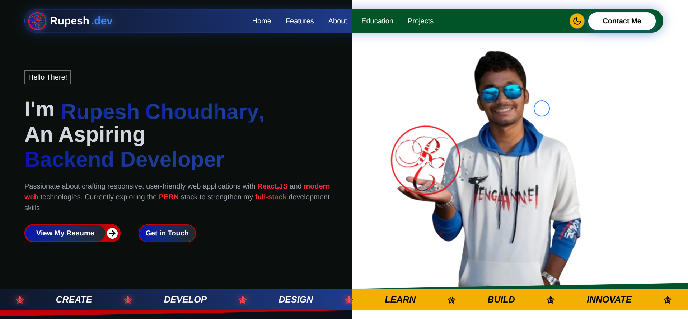

# 🚀 Personal Portfolio

This is my personal **Portfolio Website** built using **React.js** and **Tailwind CSS**.  
The portfolio showcases my skills, projects, and experience as a frontend developer.

---

## 🖥️ Tech Stack

### **Frontend**
- ⚛️ React.js  
- 🎨 Tailwind CSS  
- 🌙 Dark Mode Support

### **Tools & Libraries**
- React Icons  
- Git & GitHub  

---

## 📁 Features

- Fully **responsive design**  
- Clean and modern UI  
- **Projects Showcase** section  
- **Skills** & **Education** section  
- **Dark/Light mode** toggle  
- **Reusable components**  
- **Fast performance** with React + Tailwind  

---

## 📸 Screenshots




---

## ⚙️ Installation & Setup

```bash
# Clone the repository
git clone https://github.com/rupeshchy10/portfolio_using_react_and_tailwind.git

# Go into the project directory
cd portfolio_using_react_and_tailwind

# Install dependencies
npm install

# Start development server
npm run dev
```

---

## ✨ About Me

Hi, I'm **Rupesh Choudhary** — a passionate **Web Developer** with a strong focus on  
**React.js**, **JavaScript**, and **Tailwind CSS**. I’m currently expanding my skills in  
**Node.js**, **PostgreSQL**, and backend development as I work toward becoming a  
**Full Stack Developer**.

I enjoy crafting clean, responsive, and user-friendly web applications that blend  
functionality with great user experience.

This portfolio reflects my learning journey, the projects I've built, and the  
skills I continue to refine every day.


---

## 📬 Contact

Feel free to reach out!

- 📧 **Email:** rupevilary1010@gmail.com  
- 🔗 **LinkedIn:** [linkedin.com/in/rupeshchy10](https://linkedin.com/in/rupeshchy10)  
- 🐙 **GitHub:** [github.com/rupeshchy10](https://github.com/rupeshchy10)

---